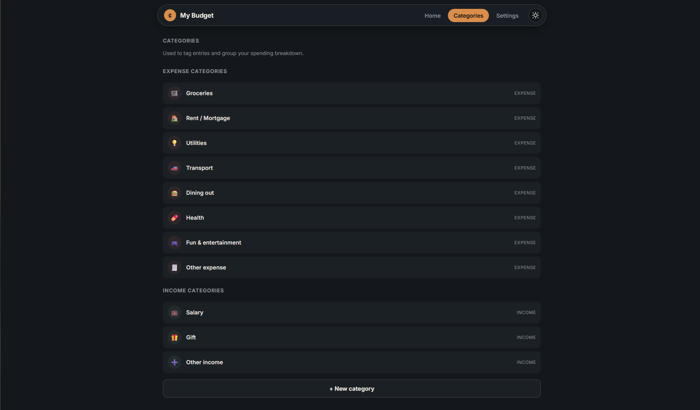

# 💰 Smart Budget

A smart and intuitive budget management application designed to help you keep track of your finances, monitor expenses, and achieve your financial goals with ease.

---

## 📸 Screenshots

| PC Dark 1.0 | PC Light 1.0 |
| :---: | :---: |
|  |  |

| PC Dark 2.0 | PC Light 2.0 |
| :---: | :---: |
|  |  |

| Phone Dark | Phone Light |
| :---: | :---: |
|  |  |

| Categories | Login Screen |
| :---: | :---: |
|  |  |

---

## 🚀 Features

- **Expense & Income Tracking:** Easily log your daily earnings and spendings.
- **Visual Analytics:** View interactive charts and breakdowns of your monthly financial habits.
- **Budget Goals:** Set custom budget limits for different categories.
- **User-Friendly Interface:** Clean, responsive, and easy-to-navigate design.

---

## 🛠️ Tech Stack

- **Frontend / UI:** HTML, CSS, JavaScript
- **Backend:** Node.js / Python
- **Database:** LocalStorage / MongoDB

---

## 📦 Installation & Setup

1. **Clone the repository:**
   ```bash
   git clone [https://github.com/mr-shadow00/Smart-Budget.git](https://github.com/mr-shadow00/Smart-Budget.git)
